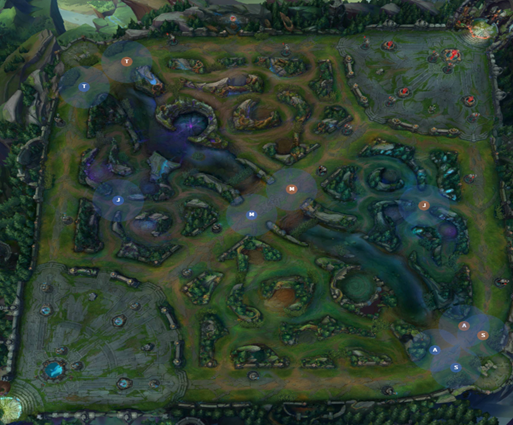

```{r setup, include=FALSE}
options(htmltools.dir.version = FALSE, width = 50)
```

## 大纲

- 研究背景

- 阐释模型理论

- 探索模型应用

- 小结与展望

---
class: inverse, center, middle

## 研究背景

???

第一部分是研究背景

---

## 一些判别问题

- 新冠肺炎确诊病例的诊断

- 气象预测

- 社会调查

- 经济学

- 互联网

······

???

一个病人有发烧、咳嗽、头痛、呼吸困难等症状，医生要判断他患的是普通流行性感冒还是新型冠状病毒。

根据过去已有气象资料（如气温、气压、湿度等）来判断明天是晴天还是阴天，进而判断是有雨还是无雨。

---

## 什么是判别分析？

设有 $k$ 个 $p$ 维总体 $G_1, G_2, ···,G_k$，其总体分布已知（如已知分布函数为 $F_1(x), F_2(x), ···, F_k(x)$，
或有来自各个总体的样本，从这 $k$ 个 $p$ 维总体中抽样推断）。

对于给定的一个新样品 $X$，我们要判断它来自这 $k$ 个总体中的哪一个。

---

## 线性判别分析的提出

- Fisher 1936年的经典论文：[The use of multiple measurements in taxonomic problems](https://onlinelibrary.wiley.com/doi/abs/10.1111/j.1469-1809.1936.tb02137.x)

- iris 数据集

- 对鸢尾花的测量数据进行统计分析是为了说明 versicolor 是 virginica 与 setosa 的中间品种，并且 versicolor 和 virginica 
的亲缘距离与和 setosa 的亲缘距离的比值应该是1:2

???

这个数据集在我们的教学过程中经常被用来做判别或无监督聚类（因为鸢尾花测量数据的特征和样本量都比较少，
并且不同品种的鸢尾花组间差异非常明显），那 Fisher 在当时就是对这个数据集做了一个线性判别分析，
但其目的并不是为了对三种鸢尾花判别归类，而是为了计算三个品种之间亲缘关系的远近。实际上判别三种鸢尾花的依据是种子。

关于这一点 Fisher 在其论文中明确提到了，

通过比较这三个品种线性判别函数结果之间的距离就可以对其亲缘关系的远近进行推断。

---

## 线性判别分析的提出

.center[[](https://onlinelibrary.wiley.com/doi/epdf/10.1111/j.1469-1809.1936.tb02137.x)]

???

线性判别分析的结果（也就是三种鸢尾花线性判别函数的频数直方图）证实了1:2这个比值。而且后续在基因（也就是鸢尾花核糖体RNA的一个亚基）
上研究也确认了这个比例。

---

## 线性判别分析的一些成功应用

- 传统学科

    - 生物学
    - 医学
    - 经济学

???

线性判别分析自1936年由 Fisher 首次提出并应用于生物分类。

在医学领域通过历史患者资料建立判别函数有助于识别各种疾病的特征，并根据患者的临床症状将其分类。

在这之后，1968年 Altman 将线性判别分析引入基于财务比率和其他金融变量的破产预测中并提出了 Altman Z-score 模型，
是第一个用来系统解释公司进入破产或存活的统计学工具。

--

- 模式识别和人工智能

    - 语音识别
    - 人脸识别
    - 步态识别
    - 手势识别
    - 行人再识别

    ······

???

80年代后随着计算机的发展及机器学习和人工智能的兴起，处理的数据量越来越大，线性判别分析由于其具有种降维特征选择的特性
在1996年被 Belhumeur 引入模式识别和人工智能领域，并广泛应用于

如在人脸识别系统中，人脸图片被转化为大量的像素，线性判别分析就可以在分类之前将这些像素转化为数量更少、更易于处理的特征，
这些特征也因此被叫做 Fisher 脸，后续就根据 Fisher 脸建模。

---

## 线性判别分析在英雄联盟单双排对局预测中的应用

- 英雄联盟14分钟时的对局时间线数据

- 探索性数据分析

- 线性判别分析（主要是 Bayes 判别）

???

本文继续探究线性判别分析的应用，即将线性判别分析应用到《英雄联盟》的对局时间线数据中，
通过结合时间线数据的探索性数据分析及线性判别分析以期得到一些对英雄联盟玩家有帮助的信息，并希望利用游戏前期的数据，通过线性判别分析预测对局的胜负。

---
class: inverse, center, middle

## 线性判别分析的理论及方法

???

第二部分是阐释模型理论

--

### 距离判别法

--

### Fisher 线性判别函数

--

### Bayes 判别规则

---

## 距离判别法

- 直观导出

$$d(x,y) \triangleq [(x-y)'\Sigma^{-1}(x-y)]^{\frac{1}{2}}$$

- 似然比检验

$$\begin{align}
W(y) &= \ln{\frac{f_1(y)}{f_2(y)}}\\
&= \frac{1}{2}[(y-\mu_2)'\Sigma^{-1}(y-\mu_2)-(y-\mu_1)'\Sigma^{-1}(y-\mu_1)]\\
&= (\mu_1-\mu_2)'\Sigma^{-1}(y-\frac{\mu_1+\mu_2}{2})
\end{align}$$

???

距离判别可以从很多不同的角度导出，直观坦率地讲就是样品和哪个总体的距离最近，就把它判给哪个总体，
在具体实施时根据所研究问题的情况会采用不同的“距离”定义。通常使用比较多的“距离”定义是1936年由印度统计学家 Mahalanobis 提出的马氏距离

除了直观的距离导出以外，距离判别还可以从假设检验的角度导出，在正态总体同协方差矩阵的情形下，通过仿照似然比检验的想法可以导出两总体时的判别函数

另外可以看出通过仿照似然比导出的判别函数 $W(y)$ （不考虑常数项因子）其实就是一个二次型的差，而这个二次型和前面提到的欧几里得空间中的马氏距离是一致的。

---

## Fisher 线性判别函数

Fisher 准则：
$$\Delta(a) \triangleq \frac{a'Ma}{a'\Sigma a}$$

最大化 Fisher 准则得到的最优线性判别函数为
$$W_1(y)=a'_1y$$

分别计算 $W_1(y)$ 与各个 $W_1(\mu_i)$ 之间的距离

$$d(W_1(y),W_1(\mu_i)) = \frac{|a'_1y-a'_1\mu_i|}{(a'_1\Sigma_i a_i)^\frac{1}{2}}$$

???

在距离判别中导出的判别函数可以是指标变量的一次函数（总体协方差矩阵相同时），也可以是指标变量的二次函数（总体协方差矩阵不同时）。
在这种情况下，Fisher 提出了只考虑判别函数是线性（一次函数）的那种情况，即以各个指标变量或特征的加权和为一个新的综合指标作为判别归类的依据。
这就要求在所有的线性判别函数中找到最优的那个线性判别函数，为了找到最优的线性判别函数，Fisher 提出了一个准则：
在判别函数总方差之上衡量判别函数在各个总体中的均值应该具有较大的离差。这个准则被称为 Fisher 准则。

在得到线性判别函数之后，就可以根据线性判别函数来对给定的某一样品 $y$ 进行判别归类，但在这之前首先需要给出判别规则。根据线性判别函数
$W_1(y)$ 进行判别的规则是：

---

## Bayes 判别规则

$\pi_j$ 为来自于总体 $G_j$ 的先验概率

$L(i,j)$ 为来自于总体 $G_j$ 却被误判为 $G_i$ 的损失，误判概率为
$$p_{ij} = \int_{D_i} f_j(y)dy$$

风险函数
$$\sum_{i=1}^kL(i,j)p_{ij} = \sum_{i=1}^k L(i,j) \int_{D_i} f_j(y)dy$$

???

Bayes 判别的思想也是由 Fisher 首先提出来的，具体就是将 Bayes 定理直接应用到判别问题上。
从 Bayes 判别中也能看出来 Wald 在1950年提出的统计判决理论的影子，其中的一些概念在判决理论中也有了更一般的表达。

将误判概率与误判损失相结合得风险函数（即平均损失函数）为

---

## Bayes 判别规则

误判的 Bayes 风险
$$\begin{align}
R_{\pi}(D) &= \sum_{j=1}^k \pi_j \sum_{i=1}^kL(i,j)p_{ij}\\
&= \sum_{j=1}^k \pi_j \sum_{i=1}^k L(i,j) \int_{D_i} f_j(y)dy
\end{align}$$

最小化 Bayes 风险就可以得到 Bayes 判别规则，且当 $G_j$ 为正态同方差时，是样品 $y$ 的一个线性函数。

???

又因为样品 $y$ 来自于总体 $G_j$ 的先验概率为 $\pi_j$，得

---
class: inverse, center, middle

## 线性判别分析在英雄联盟单双排对局预测中的应用

???

“破产版” KI 上校

第三部分是探索模型应用

---
class: inverse, center, middle

## 来了老弟，听说你们在等我 
## — 肯德基 KI 上校

???

首先来了解一下KI上校的对于胜率的计算规则，首先第一点就是随着游戏的进程，不断变化的游戏信息，在不考虑队伍和选手因素的情况下进行计算。
在游戏中大家都会提到一个优势方和劣势方，KI上校是把这个优势和劣势转为了一个具体的数值，就是优势到底有多大。而优势是从哪些方面来的呢?可不仅仅是是经济曲线!

大家应该是知道的，AI想要分析，首先就要学习，KI上校学习的对象就是历届职业比赛以及历届S赛和韩服高端排位的数据，当然，也是会对数据进行筛选的，
将没有意义的数据剔除掉。那么通过学习之后会评估哪些数据呢?主要是这四点：1.双方的英雄阵容、2.每个英雄的当前经验/装备/等级、3.建筑资源、4.中立生物的资源。

这四个点除了第一个都没什么好说的，双方的英雄阵容怎么看的，第一是当前版本的英雄强度，二是敌对英雄的克制关系，三是己方英雄的配合关系。
同过这三点就能得出阵容的强度，双方阵容的克制关系，协作强度等等关系。通过这些来计算出了KI上校的实时胜率曲线，但是就如同一开始说到的，
这个计算是排除了选手对游戏的影响，但是选手恰恰是对游戏进程影响最大的因素，哪怕是KI上校给出了91开，经济差距1万，选手的一波失误照样会导致游戏的失败。

---

.center[]

--

.center[]

.footnote[来源：[英雄联盟赛事](https://lpl.qq.com/)]

???

不要抱有太高的期望

---

## 召唤师峡谷地图

.center[]

.footnote[来源：[riftkit.net](https://map.riftkit.net/)]

???

在召唤师峡谷地图中有三条路线，分别称为上路、中路和下路，在这三条路线上蓝色方和紫色方分别拥有3座一塔，3座二塔，3座高地防御塔，
每个队伍的目标都是摧毁对方的防御塔，同时保护自己的防御塔不被对方摧毁。

除了线上之外，召唤师峡谷地图上剩下的就是野区的中立资源了。有5种中立资源，分别是野怪、小龙、远古龙、峡谷先锋以及大龙。
召唤师获得这些中立资源会得到金币的奖励和英雄属性加成，所以这也是蓝色方和紫色方队伍成员争夺的目标。

---

## 游戏对局数据说明

- 拳头游戏开发者账号 API<sup>1</sup>：RGAPI-1e2ece0e-85d4-4644-a358-90d7c375d088（已过期）

- Python 封装库

    - Riot-Watcher<sup>2</sup>

    - Cassiopeia<sup>3</sup>

.footnote[
[1] https://developer.riotgames.com/

[2] https://github.com/pseudonym117/Riot-Watcher

[3] https://github.com/meraki-analytics/cassiopeia
]

???

英雄联盟召唤师峡谷经典模式对局的时间线数据是游戏进程中每分钟数据的快照，其中包括两种类型的数据：参与者数据和事件数据。

参与者数据每分钟都会提供一个快照，包括英雄的属性数据，如生命值、法力值、攻击力、护甲、魔抗、技能急速等。
以及当前时刻的总金币、输出及承受伤害、小兵击杀数、野怪击杀数、英雄等级、在地图上的位置、经验值。

事件数据就是游戏进程中发生特定事件的记录，如物品购买、英雄升级、英雄技能升级、击杀或参与击杀敌方英雄、摧毁敌方防御塔、
夺取中立资源如小龙、峡谷先锋、大龙、远古龙等。

---

## 游戏对局数据说明

```{r include = FALSE}
xfun::pkg_attach2(c('GGally', 'ggplot2', 'dplyr', 'tidyr', 'forcats', 'viridis'))


timeline_840 = read.csv('https://raw.githubusercontent.com/loreliu/bachelor-thesis/main/timeline_840.csv', header = TRUE,
    encoding = 'UTF-8')
# timeline_840 = read.csv('timeline_840.csv', header = TRUE, encoding = 'UTF-8')

# 因子化 winningTeam
timeline_840$winningTeam = as.factor(timeline_840$winningTeam)

summary(timeline_840)

# 分组 summary
summary_blue_red = by(timeline_840[, 1:15], timeline_840$winningTeam, summary)
summary_blue_red

# 分组 std
timeline_840_winningTeam_blue = timeline_840$winningTeam == 100
sd_winblue = lapply(timeline_840[timeline_840_winningTeam_blue, ][, 1:15], sd)
sd_winred = lapply(timeline_840[!timeline_840_winningTeam_blue, ][, 1:15], sd)
sd_winblue
sd_winred


attach(timeline_840)
dragonDiff = t1Dragons - t2Dragons
riftDiff = t1Rift - t2Rift
topTowerTakenDiff = t1TopTowerTaken - t2TopTowerTaken
midTowerTakenDiff = t1MidTowerTaken - t2MidTowerTaken
botTowerTakenDiff = t1BotTowerTaken - t2BotTowerTaken
summary(cbind(dragonDiff, riftDiff, topTowerTakenDiff, midTowerTakenDiff, botTowerTakenDiff))
timeline_840_Diff = cbind(timeline_840, cbind(dragonDiff, riftDiff, topTowerTakenDiff, midTowerTakenDiff,
    botTowerTakenDiff))

# 分组 diff mean
mean_diff_winblue = lapply(timeline_840_Diff[timeline_840_winningTeam_blue, ][, 28:32], mean)
mean_diff_winred = lapply(timeline_840_Diff[!timeline_840_winningTeam_blue, ][, 28:32], mean)
mean_diff_winblue
mean_diff_winred

# 分组 diff std
sd_diff_winblue = lapply(timeline_840_Diff[timeline_840_winningTeam_blue, ][, 28:32], sd)
sd_diff_winred = lapply(timeline_840_Diff[!timeline_840_winningTeam_blue, ][, 28:32], sd)
sd_diff_winblue
sd_diff_winblue
```

```{r eval=require('DT'), echo=FALSE}
DT::datatable(
  head(timeline_840, 1000),
  extensions = c('FixedColumns', 'Scroller'),
  options = list(
  dom = 't',
  scrollX = TRUE,
  fixedColumns = TRUE,
  deferRender = TRUE,
  scrollY = 450,
  scroller = TRUE
))
```

???

因此本文选取召唤师峡谷经典模式单双排黄金分段对局时间线数据中14分钟时小龙夺取数、峡谷先锋夺取数、防御塔夺取数、
双方不同位置的经济差数据，以及游戏时长、获胜队伍和英雄选择。

共 27（2+2+6+5+2+10） 个变量。

---
class: inverse, center, middle

## 探索性数据分析

???

主要是

各变量的统计特征

蓝色方与紫色方获胜胜率分析

---

.center[]

???

绘制出的各变量的相关系数矩阵，从中可以看到蓝色方和紫色方的小龙夺取数、峡谷先锋夺取数有比较强的相关性，呈负相关，
而两队各位置的防御塔丢失数则没有这么明显的相关性。这是因为小龙和峡谷先锋是中立资源，一方夺取了，另一方自然就不能再夺取，而防御塔则是双方都具有的战略点。

还可以看到ADC和辅助的对位经济差也有比较强的相关性，这是因为两者都走下路，一个人有经济优势另一个自然也会有优势。

众所周知，在召唤师峡谷中上路是对抗路，下路是发育路，而中路由于其处于整张地图的中心位置，容易受到各个位置的影响，比如辅助游走、打野gank。
这可以从相关系数看出，比如上单对位经济差与摧毁上路防御塔的相关系数为0.5572，ADC对位经济差与摧毁下路防御塔的相关系数为0.4517，
而中单对位经济差与摧毁中路防御塔的相关系数仅为0.3702。

除了上述较强的相关性之外，各变量的相关系数矩阵中也有较低的相关系数。下路ADC和辅助的对位经济差与峡谷先锋夺取相关系数的最大绝对值为0.094，
上单对位经济差与小龙夺取的相关系的最大绝对值为0.0826，这从召唤师峡谷地图中上路和小龙的距离以及下路和峡谷先锋的距离可以看出。
上路取得对位经济优势对争夺小龙起的作用比较小，下路取得经济优势与抢到峡谷先锋同样关系不大。不过在高端对局及职业比赛中，
下路取得经济优势通常会在8分钟前回城购买装备，将经济优势转化为装备优势，然后赶到峡谷先锋处。由于其一方具有装备和等级优势，
比较容易在峡谷先锋团中取胜，进而夺得峡谷先锋。

---

## 蓝色方与紫色方获胜胜率分析

.center[]

???

绘制的各位置的分组对位经济差散点图矩阵，矩阵下半部分是分组对位经济差散点图，对角线是分组对位经济差的分布图，上半部分则是相关系数。

从下半部分的散点图中也可以看出ADC和辅助的对位经济差有较强的相关性，散点大致分布在45°直线两侧。

从对角线上的分布图可以看出来还是有不少的翻盘局发生，即14分钟前对位经济领先但最终输掉游戏的情况。
这可能是前期经济领先的一方没有控到小龙，或是前期经济落后的一方是后期阵容等等，有很多不确定的因素都可能导致被翻盘。
具体可以计算前期经济领先一方被翻盘的概率或其胜率，

---

## 14分钟时蓝色方各位置对位经济领先的胜率折线图

.center[]

???

从图中可以很轻易地看出随着经济优势的扩大，胜率也在增加。

而在同样的经济优势下，上单的胜率要低于其他四个位置。上单的胜率在对位经济差达到3000-3500左右时出现了短暂的下降，随后稳步上升。

当辅助经济领先达到2500左右时，胜率开始下降，然而在达到2500左右时，胜率又上升至100%。

ADC对位经济差在达到3500-4000左右时胜率开始下降，4000以上时开始回升。

中单和打野在经济领先达到4000后，胜率开始下降。

上述的各位置胜率在达到不同程度的经济领先时都存在短暂的下降，这可能是阵容选择的原因，也可能是玩家在取得较大的经济优势后不谨慎，没有继续扩大优势，导致被翻盘。

---

## 14分钟时蓝色方夺得小龙的胜率

```{r echo=FALSE, comment=''}
# 蓝色方夺取小龙胜率
df_prec_dragons = data.frame() # 存储计算结果
for (i in 0:2) {
    for (j in 0:2) {
        # 计算胜率
        tl_subset = timeline_840[timeline_840$t1Dragons == i & timeline_840$t2Dragons == j, ]
        prec = sum(tl_subset$winningTeam == 100) / nrow(tl_subset)
        df_prec_dragons[i + 1, j + 1] = prec
    }
}
rownames(df_prec_dragons) = c('blue_team_0', 'blue_team_1', 'blue_team_2')
colnames(df_prec_dragons) = c('red_team_0', 'red_team_1', 'red_team_2')
df_prec_dragons
```

## 14分钟时蓝色方夺得峡谷先锋的胜率

```{r echo=FALSE, comment=''}
# 蓝色方夺取峡谷先锋胜率
df_prec_rift = data.frame() # 存储计算结果
for (i in 0:1) {
    for (j in 0:1) {
        # 计算胜率
        tl_subset = timeline_840[timeline_840$t1Rift == i & timeline_840$t2Rift == j, ]
        prec = sum(tl_subset$winningTeam == 100) / nrow(tl_subset)
        df_prec_rift[i + 1, j + 1] = prec
    }
}
rownames(df_prec_rift) = c('blue_team_0', 'blue_team_1')
colnames(df_prec_rift) = c('red_team_0', 'red_team_1')
df_prec_rift
```

???

可以发现，夺取小龙的胜率增加百分比要比夺取峡谷先锋的胜率高。

---

## 14分钟时蓝色方摧毁上路防御塔数的胜率

```{r echo=FALSE, comment=''}
# 蓝色方摧毁防御塔胜率
win_prec_tower = function(role, t1TowerTaken, t2TowerTaken) {
    df_prec_tower = data.frame() # 存储计算结果
    if (role == 'top' | role == 'bot') {
            towers = 4
            }
            else {
               towers = 6
            }
    for (i in 0:towers) {
        for (j in 0:towers) {
            tl_subset = timeline_840[t2TowerTaken == i & t1TowerTaken == j, ]
            prec = sum(tl_subset$winningTeam == 100) / nrow(tl_subset)
            df_prec_tower[i + 1, j + 1] = prec
        }
        rownames(df_prec_tower)[i + 1] = paste('blue_team_', i)
        colnames(df_prec_tower)[i + 1] = paste('red_team_', i)
    }
    return(df_prec_tower)
}
win_prec_tower('top', timeline_840$t1TopTowerTaken, timeline_840$t2TopTowerTaken)
```

???

可以发现当领先同样的防御塔数时，中路和下路的胜率要比上路高。

在“14分钟时蓝色方各位置对位经济领先的胜率”中也得到了相似的结论“在同样的经济优势下，上单的胜率要低于其他四个位置”。

这反映到游戏中就是上路的Carry能力不如中路和下路，实际游戏体验也是如此。

---

## 14分钟时蓝色方摧毁中路防御塔数的胜率

```{r echo=FALSE, comment=''}
win_prec_tower('mid', timeline_840$t1MidTowerTaken, timeline_840$t2MidTowerTaken)
```


???

可以发现当领先同样的防御塔数时，中路和下路的胜率要比上路高。

在“14分钟时蓝色方各位置对位经济领先的胜率”中也得到了相似的结论“在同样的经济优势下，上单的胜率要低于其他四个位置”。

这反映到游戏中就是上路的Carry能力不如中路和下路，实际游戏体验也是如此。


---

## 14分钟时蓝色方摧毁下路防御塔数的胜率

```{r echo=FALSE, comment=''}
win_prec_tower('bot', timeline_840$t1BotTowerTaken, timeline_840$t2BotTowerTaken)
```

???

可以发现当领先同样的防御塔数时，中路和下路的胜率要比上路高。

在“14分钟时蓝色方各位置对位经济领先的胜率”中也得到了相似的结论“在同样的经济优势下，上单的胜率要低于其他四个位置”。

这反映到游戏中就是上路的Carry能力不如中路和下路，实际游戏体验也是如此。

---
class: inverse, center, middle

## 将线性判别分析应用到时间线数据预测对局胜负

???

主要是

变量选择及模型假设验证

Bayes判别函数及判别规则

---

## 变量选择及模型假设验证

- 由于 [MASS::lda](https://www.rdocumentation.org/packages/MASS/versions/7.3-57/topics/lda) 使用 Bayes 判别计算判别函数，所以需要检查不同组别中各预测变量的正态性、组别间的方差同质性以及各变量间是否有多重共线性。

- 从各位置的对位经济差直方图中可以看出各位置对位经济差是近似服从正态分布的，因此最终我们不拒绝零假设，认为各位置的对位经济差服从正态分布。其他几个变量因为取值不是连续的，不服从正态分布。

- 小龙夺取数之差、峡谷先锋夺取数之差及各位置对位经济差的 BoxM 检验不显著，p值为0.4892，认为满足方差同质性。其他6个防御塔丢失数变量不满足方差同质性。

???

在检验各位置对位经济差是否服从正态分布时，Shapiro-Wilk 检验显著，拒绝零假设“总体服从正态分布”。但此时的检验显著可能是由于样本量太大造成的，也就是说 Shapiro-Wilk 正态性检验的结论不可靠，还需要根据效应值的大小决定是否真正拒绝零假设，在此处可根据样本中各变量的直方图判断是否真正拒绝零假设。

---

## Bayes 判别函数及判别规则

```{r }
# 为了使结果可复现 从 random.org 获取一个随机数作为种子
set.seed(4225)

# 将数据集分为训练集和测试集，比例为 8:2
index_train = sample(c(TRUE, FALSE), nrow(timeline_840_Diff), replace = TRUE, prob = c(0.8, 0.2))
training = timeline_840_Diff[index_train, ]
testing = timeline_840_Diff[!index_train, ]

# 建立 Bayes 判别模型
lda_fit = MASS::lda(winningTeam ~ dragonDiff + riftDiff + t1TopTowerTaken + t2TopTowerTaken + t1MidTowerTaken +
    t2MidTowerTaken + t1BotTowerTaken + t2BotTowerTaken + topGoldDiff + jugGoldDiff + midGoldDiff +
    adcGoldDiff + supGoldDiff, prior = c(0.5, 0.5), data = training)
```

???

虽说有些变量不符合Bayes判别的假设，但无论如何，我们可以尝试将其应用到14分钟时的时间线数据上，看看预测结果怎么样。

为了使结果可复现，从 random.org 获取一个随机数作为种子（4225），将14分钟时的时间线数据分为训练集和测试集，比例为8:2。

将Bayes判别 MASS::lda 应用到训练集可以得到 Bayes 标准化判别函数（这同样也是Fisher线性判别函数。）为

---

$$\begin{align}
y = &-0.2261 \times dragonDiff\\
&+ 0.008440 \times riftDiff\\
&- 0.05458 \times t1TopTowerTaken\\
&+ 0.1875 \times t2TopTowerTaken\\
&- 0.1160 \times t1MidTowerTaken\\
&+ 0.2517 \times t2MidTowerTaken\\
&- 0.1367 \times t1BotTowerTaken\\
&+ 0.1706 \times t2BotTowerTaken\\
&- 0.0003078 \times topGoldDiff\\
&- 0.0003615 \times jugGoldDiff\\
&- 0.0003349 \times midGoldDiff\\
&- 0.0003208 \times adcGoldDiff\\
&- 0.0001308 \times supGoldDiff
\end{align}$$

???

将 Bayes 判别 MASS::lda 应用到训练集可以得到 Bayes 标准化判别函数（这同样也是Fisher线性判别函数。）为


---

# Bayes 判别规则

$$\begin{cases}
蓝色方获胜 & y \leqslant 0,\\
紫色方获胜 & y > 0.
\end{cases}$$

.pull-left[
.center[在训练集上的混淆矩阵
```{r echo=FALSE, comment=''}
# 训练集混淆矩阵
table(Actual = training$winningTeam, Predicted = predict(lda_fit)$class)
```
预测正确率为75.78%
]]

.pull-right[
.center[在测试集上的混淆矩阵
```{r echo=FALSE, comment=''}
# 测试集混淆矩阵
table(Actual = testing$winningTeam, Predicted = predict(lda_fit, newdata = testing)$class)
```
预测正确率为74.51%
]]

???

最终得到Bayes（Fisher）判别规则

是Bayes判别在训练集上的混淆矩阵，预测正确率为75.78%。

是Bayes判别在测试集上的混淆矩阵，预测正确率为74.51%。

默认情况下，MASS::lda 函数在根据后验概率判别时选用的临界值为0.5（随机猜测），因此可以尝试寻找使得预测正确率最大的临界值。

在训练集上，当临界值为0.49时，预测正确率最大，为76.00%；在测试集上，当临界值为0.42时，预测正确率最大，为75.28%。

因此为了更准确地预测对局胜负，选用0.42作为后验概率的临界值。

---

.center[]
.center[]

???

Bayes（Fisher）判别函数的直方图

Bayes（Fisher）判别函数在测试集对位经济差上的分区图

可以看到Bayes判别的结果有部分重叠，即Bayes判别函数的结果在 y=0 附近时没有预测正确，但总体上Bayes判别函数把大部分样品都正确地分离开了。

---
# 测试集部分正判样品
```{r eval=require('DT'), echo=FALSE}
DT::datatable(
  head(testing[testing$winningTeam == predict(lda_fit, newdata = testing)$class, ]),
  extensions = 'FixedColumns',
  options = list(
  dom = 't',
  scrollX = TRUE,
  fixedColumns = TRUE
))
```

???

通过测试集部分正判可以发现 Bayes 判别正确地预测胜负时，获胜的一方在14分钟时要比失败的一方领先很多。这些领先包括小龙、峡谷先锋、防御塔以及队伍总经济。

在中立资源及防御塔上。获胜方几乎控到了所有资源，而失败方则几乎颗粒无收。

在对位经济差上获胜方队伍里虽然有一个或两个位置落后，但其他位置领先要的更多，这使得队伍总经济要领先对方。

---

# 测试集部分误判样品
```{r eval=require('DT'), echo=FALSE}
DT::datatable(
  head(testing[!(testing$winningTeam == predict(lda_fit, newdata = testing)$class), ]),
  extensions = 'FixedColumns',
  options = list(
  dom = 't',
  scrollX = TRUE,
  fixedColumns = TRUE
))
```

???

在 Bayes 判别错误地预测胜负的对局里，14分钟时双方队伍总经济接近于持平，小龙、峡谷先锋、防御塔也互有领先。

除了个别位置的英雄选择外，整个队伍的阵容搭配对游戏能否取胜也至关重要。

如样品2中蓝色方除了ADC薇恩和上路德莱厄斯之外，其他3个位置的经济都有很大的落后，在中立资源夺取上也落后于紫色方，但蓝色方阵容打团就是比紫色方厉害，
慢慢发育打团不出意外稳赢，可以看到这场对局也是到了32分钟左右才由蓝色方获胜结束。

---

## 测试集预测正确和预测错误时游戏时长的小提琴图

.center[]

???

并且误判的对局场均时长要高于正判的场均时长,这可以从小提琴图中看出。
14分钟时双方均势对局，前期英雄没有取得比较大的优势，发育到中后期自然不如后期英雄对游戏的影响大。

<!-- 在前面“蓝色方与紫色方获胜胜率分析”中提到了上路的Carry能力不如中路和下路，如样品4中紫色方上单普朗克取得了2618的对位经济差，但不如蓝色方ADC薇恩的2144经济差；样品1中蓝色方上单莫德凯撒领先了1505的对位经济差，不如紫色方中路派克307及ADC莎弥拉323的经济差；样品5中蓝色方上野各取得了2925和1392的对位经济差，但不如紫色方中下黑默丁格和吉格斯的491和178经济差。 -->

---
class: center, middle, inverse

## 英雄联盟这个游戏，不只有对线，还有打团

--

## 前期对线拿到优势并不等于这把游戏就拿下了，一个好的阵容选择是赢下游戏的第一步

---

## 小结与展望

- Fisher 提出线性判别分析

- 对英雄联盟时间线数据的探索性数据分析

- 对英雄联盟时间线数据建立线性判别分析（主要是 Bayes 判别）模型

???

第四部分（最后一部分）是小结与展望。

线性判别分析作为一种分类和降维特征选择方法，在1936年Fisher提出之时，只是为了计算三种鸢尾花之间亲缘关系的远近，并不是为了将它们分类。
而在我们的教学过程中，无论是书本还是老师，都告诉我们“Fisher提出线性判别分析是为了将三种鸢尾花区分开”，但事实上并不是这样。
这个几乎“公认”的说法在我们的教学过程中如此之流行应该被反思。

通过观察各变量的相关系数矩阵，发现下路对位经济差和小龙夺取有较强的相关性，上单对位经济差和峡谷先锋夺取有较强的相关性；
ADC和辅助的对位经济差有较强的相关性；
上单经济差和上路防御塔摧毁的相关性要高于下路和中但，其中中单经济差和中路防御塔摧毁的相关系数最低。

通过对蓝色方与紫色方获胜胜率的分析，得出了控小龙比控峡谷先锋更好赢以及上单的Carry能力不如中单和ADC。

这些结论在我们平时游戏里都或多或少能感受得到。

在对时间线数据建立线性判别分析预测对局胜负中，我们得到了Bayes判别函数。其在训练集上的预测正确率最大为76.00%，在测试集上的预测正确率最大为75.28%。也就是说我们只通过14分钟时的部分时间线数据就能正确预测75%左右的对局，这个结果还算可以（破产版 KI 上校）。

在线性判别分析模型中，我们只考虑了双方小龙夺取数之差、峡谷先锋夺取数之差、防御塔丢失数以及各位置的对位经济差，而没有考虑双方的英雄选择和阵容。除了这些游戏内的因素外，游戏外的因素也对游戏胜负有很大的影响，如玩家的心态。甚至可以夸张一点地说英雄联盟这款游戏心态比游戏水平更加重要，但这并不是模型所能度量的了。

英雄联盟这个游戏，不只有对线，还有打团。前期对线拿到优势并不等于这把游戏就拿下了，稳扎稳打才能最终拿下胜利；前期劣势也不要摆烂，放平心态，慢慢发育打团，尽力就好。

---
class: center, middle

# 谢谢！
